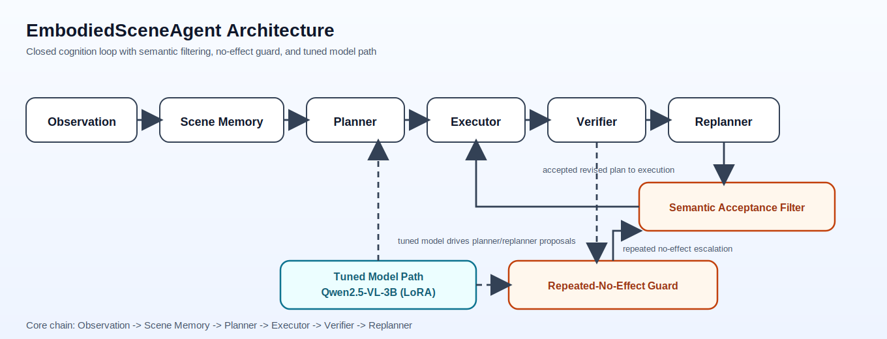
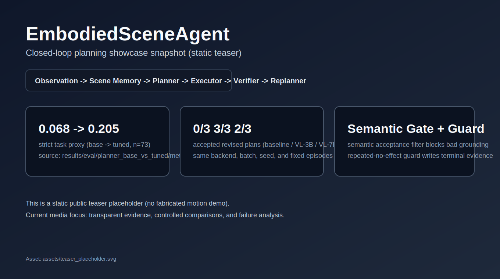

# EmbodiedSceneAgent

EmbodiedSceneAgent is a research codebase for embodied-task replanning under changing scene state. The current implementation centers on a closed cognition loop — `Observation -> Scene Memory -> Planner -> Executor -> Verifier -> Replanner` — with explicit schema checks, semantic acceptance filtering, and failure-aware recovery paths.



## At a glance

| Signal | Current evidence |
|---|---|
| Primary quantitative (`n=73`) | format compliance `1.000 -> 1.000` |
|  | tool-use accuracy `0.082 -> 0.219` |
|  | target-match rate `0.329 -> 0.479` |
|  | strict task proxy `0.068 -> 0.205` |
| Tiny controlled comparison (`3` episodes) | baseline accepted revised plans `0/3` |
|  | VL-3B accepted revised plans `3/3` |
|  | VL-7B accepted revised plans `2/3` |
| Scope boundary | proxy metrics are not official environment success rates; tiny set is diagnostic only |

## Teaser / Quick Showcase



Static public teaser snapshot (placeholder).  
It provides a compact view of the current closed-loop pipeline and result highlights, without implying an animated demo.

## Why this matters

In embodied settings, failures are often easy to miss in one-shot text outputs: object grounding can be wrong, preconditions can be omitted, and actions can repeat without effect. This repository makes those failure modes observable and easier to recover from through structured interfaces and explicit runtime guards.

## What is implemented now

- Closed-loop pipeline: `Observation -> Scene Memory -> Planner -> Executor -> Verifier -> Replanner`.
- Structured planner contract (`task`, `subgoal`, `target_object`, `skill`, `success_check`, `fallback`) with parser/repair/validation stages.
- Semantic acceptance filter that blocks schema-valid but scene-inconsistent revised plans (for example `target_absent_from_scene_memory`, `drawer_goal_target_mismatch`).
- Repeated-no-effect guard with explicit terminal labeling (`repeated_no_effect_fallback_exhausted`).
- Tuned path for `Qwen/Qwen2.5-VL-3B-Instruct` (minimal LoRA SFT) with reproducible artifacts.
- A tiny controlled comparison track including baseline, VL-3B, and VL-7B replanner runs.

## Key results

Primary quantitative evidence (`n=73`, source: `results/eval/planner_base_vs_tuned/metrics.json`):

| Track | Format compliance | Tool-use accuracy | Target-match rate | Strict task proxy |
|------|---:|---:|---:|---:|
| Stable baseline | 1.000 | 0.082 | 0.329 | 0.068 |
| Tuned (LoRA 3B minimal) | 1.000 | 0.219 | 0.479 | 0.205 |

Secondary tiny controlled comparison (`3` fixed episodes, same backend/batch/seed):

- Baseline accepted revised plans: `0/3`
- VL-3B accepted revised plans: `3/3`
- VL-7B accepted revised plans: `2/3`

Important scope notes:

- The strict task metric above is a proxy metric, not official CALVIN environment success rate.
- The 3-case comparison is diagnostic and qualitative, not benchmark-scale statistical evidence.
- In this tiny setting, VL-3B is the strongest model on the secondary qualitative track.
- VL-7B runs successfully in part, but does not outperform VL-3B on this tiny set.

## Minimal verification

After cloning, run this 3-command path:

```bash
bash scripts/setup_env.sh
bash scripts/showcase_smoke.sh
bash scripts/run_minimal_eval.sh
```

Expected outputs:

- `results/showcase/showcase_smoke.log`
- `results/showcase/minimal_eval_summary.md`

## Architecture overview

- Visual: `assets/architecture_overview.svg`
- Editable source: `assets/architecture_overview.md`
- The diagram marks the semantic acceptance filter, repeated-no-effect guard, and tuned model path.

## Repository structure

- `src/`: implementation of memory, planning, verifier, replanner, adapters, and CLI entrypoints.
- `configs/`: runtime and experiment configuration files.
- `scripts/`: setup, smoke, and reproducible evaluation wrappers (including showcase scripts).
- `tests/`: unit/integration tests for the core cognition loop and contracts.
- `docs/`: public project docs (`project_overview`, `showcase_results`, `showcase_cases`, `limitations`).
- `assets/`: lightweight public-facing architecture and pipeline artifacts.
- `results/`: generated experiment/evaluation artifacts used as evidence.
- `archive/course_submission/`: pointers to course/report-oriented materials retained for audit history.

## Limitations

- No official CALVIN/RLBench leaderboard claim is made.
- RLBench full simulator execution is not available in this machine snapshot; fixture bridge paths are used for smoke-level wiring checks.
- Tiny 3-case findings are useful for diagnosis, but not enough to support broad generalization claims.
- Terminal failures are still frequently dominated by repeated no-effect execution dynamics.

## Short roadmap

- Expand controlled evaluations beyond tiny case counts while keeping strict evidence boundaries.
- Improve execution-side recovery after semantically valid replans.
- Add richer public-facing visual assets (for example short teaser media) while keeping evidence auditable.

## Public docs

- `docs/project_overview.md`
- `docs/showcase_results.md`
- `docs/showcase_cases.md`
- `docs/limitations.md`

## Archive note

Course/report packaging materials are intentionally de-emphasized in the main flow; details remain in `archive/course_submission/README.md`.
