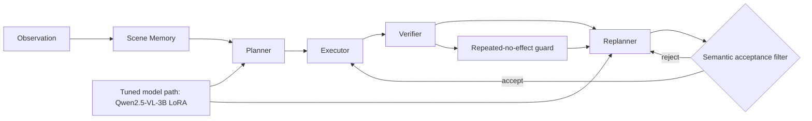

# Architecture Overview

Notes:

- The semantic acceptance filter blocks schema-valid but scene-inconsistent revised plans before execution.
- The repeated-no-effect guard stops repeated ineffective retries and writes explicit terminal evidence.
- The tuned model path is currently centered on `Qwen/Qwen2.5-VL-3B-Instruct` minimal LoRA artifacts.
